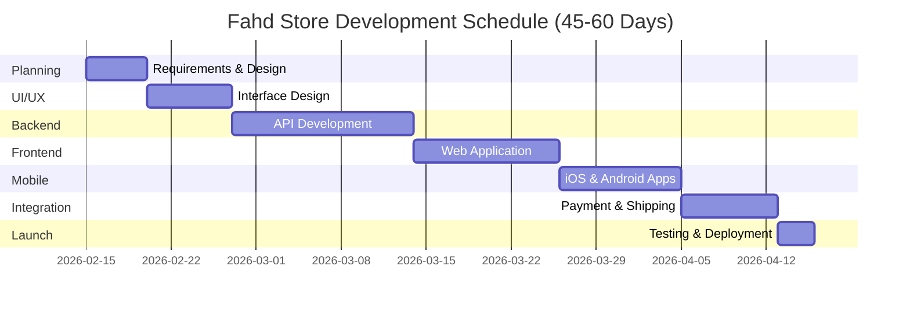
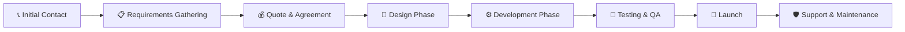

# 🚀 Fahd Store - Professional E-commerce Platform

<div align="center">


### *Your Own "Noon" - Complete E-commerce Empire in 45-60 Days*

[🌐 Live Demo](#) | [📱 Features](#-key-features) | [💰 Pricing](#-pricing) | [📞 Contact](#-get-started)

---

</div>

## 🌟 Transform Your Business Vision Into Reality

**Fahd Store** is not just another e-commerce platform—it's your complete digital business infrastructure, designed to compete with industry giants like Noon, Amazon, and Souq.

### 🎯 What Makes Fahd Store Different?

```
✨ Professional Grade    →  Enterprise-level quality at startup prices
⚡ Lightning Fast        →  45-60 days from concept to launch
🎨 Modern Design         →  Glassmorphism UI with stunning animations
📱 Multi-Platform        →  iOS + Android + Web (all included)
🔐 Bank-Level Security   →  PCI DSS compliant payment processing
🚀 Scalable Architecture →  Built to handle millions of users
```

---

## 💎 Three Powerful Platforms in One

<table>
<tr>
<td width="33%" align="center">

### 📱 Customer App
**iOS + Android + Web**

🛍️ Seamless Shopping Experience  
💳 Multiple Payment Options  
📍 Real-time Order Tracking  
⭐ Reviews & Ratings  
🎁 Loyalty Program

</td>
<td width="33%" align="center">

### 🏪 Vendor Dashboard
**Multi-Vendor System**

📦 Product Management  
📊 Sales Analytics  
💰 Commission Tracking  
🚚 Shipping Integration  
📈 Performance Reports

</td>
<td width="33%" align="center">

### ⚙️ Admin Panel
**Complete Control**

👥 User Management  
🎯 Campaign Creation  
📉 Business Intelligence  
🔧 System Configuration  
💵 Financial Reports

</td>
</tr>
</table>

---

## 🔥 Key Features

### 💳 Payment Integration
- **Local**: Mada, STC Pay, Apple Pay
- **International**: Visa, Mastercard, PayPal
- **Buy Now Pay Later**: Tabby, Tamara (Installment options)

### 🚚 Smart Logistics
- **Shipping Partners**: SMSA, Aramex, DHL
- **Real-time Tracking**: GPS-enabled delivery monitoring
- **Auto-calculation**: Smart pricing based on location & weight

### 🔔 Intelligent Notifications
- **Push Notifications**: iOS & Android native alerts
- **SMS Alerts**: Order updates via Twilio/Unifonic
- **Email Marketing**: SendGrid/Mailchimp integration

### 🤖 AI-Powered Features
- **Smart Recommendations**: Machine learning product suggestions
- **Chatbot Support**: 24/7 automated customer service
- **Visual Search**: Image-based product discovery
- **Demand Forecasting**: Inventory optimization

### 🔍 Advanced Search
- **Elasticsearch**: Lightning-fast product search
- **Auto-complete**: Smart search suggestions
- **Filters**: Price, brand, rating, availability
- **Voice Search**: Hands-free shopping experience

### 📄 Compliance & Security
- **ZATCA Integration**: Saudi e-invoicing (Fatoora)
- **VAT Calculation**: Automatic tax computation
- **PCI DSS Compliant**: Secure payment processing
- **SSL/TLS**: End-to-end encryption

---

## 🛠️ Technology Stack

<div align="center">

### Frontend


### Backend


### Cloud & DevOps


</div>

---

## ⏱️ Development Timeline



### Week-by-Week Breakdown

| Week | Phase | Deliverables |
|------|-------|-------------|
| **Week 1** | 📋 Planning & Design | Requirements Doc, Wireframes, ERD |
| **Week 2-3** | 🎨 UI/UX Design | High-fidelity Designs, Style Guide |
| **Week 4-6** | ⚙️ Backend Development | RESTful APIs, Database, Admin Panel |
| **Week 7** | 🔗 Integration | Payment Gateways, Shipping APIs |
| **Week 8** | 🧪 Testing | QA, Bug Fixes, Performance Optimization |
| **Week 9** | 🚀 Launch | Production Deployment, App Store Submission |

---

## 💰 Pricing

<div align="center">

### 🎉 Exclusive Launch Offer

<table>
<tr>
<td width="50%" align="center">

#### ❌ Market Rates
🇸🇦 **Gulf Companies**  
~~15,000 - 22,000 SAR~~

🇪🇺 **European Agencies**  
~~25,000 - 35,000 SAR~~

</td>
<td width="50%" align="center">

#### ✅ Your Special Price
🎁 **Complete Package**  
### **7,000 - 10,000 SAR**

⏰ **Duration**: 45-60 Days  
💾 **Save**: 60% Off Market Price

</td>
</tr>
</table>

</div>

### What's Included? ✨

<details>
<summary><b>👉 Click to See Complete Package Details</b></summary>

#### ✅ Development
- Complete Web Application (Customer + Vendor + Admin)
- iOS Native App
- Android Native App
- Backend APIs (RESTful)
- Professional UI/UX Design

#### ✅ Integration
- 3 Payment Gateways (Mada, Visa/Mastercard, Tabby)
- 2 Shipping Companies (SMSA + Aramex)
- SMS Service (OTP & Notifications)
- Email Service (Marketing & Notifications)
- Google Analytics & Firebase

#### ✅ Infrastructure
- 2 Months Free Hosting (AWS)
- SSL Certificates
- CDN Setup (CloudFront)
- Database Configuration
- CI/CD Pipeline

#### ✅ Support & Training
- 2 Months Technical Support
- Bug Fixes & Security Updates
- Complete Training Sessions
- User Documentation
- Video Tutorials

#### ✅ Ownership
- Full Source Code
- Database Schema
- Technical Documentation
- Deployment Scripts
- Transfer of All Rights

</details>

---

## 🎯 Performance Metrics

<div align="center">

| Metric | Target | Status |
|--------|--------|--------|
| 🚀 Page Load Time | < 2 seconds | ✅ Optimized |
| 📱 Mobile Performance | 90+ Score | ✅ Excellent |
| 🔐 Security Grade | A+ | ✅ Bank-Level |
| ⚡ API Response | < 200ms | ✅ Lightning Fast |
| 📈 Uptime SLA | 99.9% | ✅ Guaranteed |
| 👥 Concurrent Users | 10,000+ | ✅ Scalable |

</div>

---

## 🌐 Multi-Language Support

<div align="center">

🇸🇦 **Arabic** | 🇬🇧 **English**

*Auto-detects browser language*  
*Seamless switching between languages*  
*RTL & LTR support*

</div>

---

## 📱 Design Philosophy

### Modern Glassmorphism UI

```
🎨 Frosted Glass Effects    →  Premium, modern aesthetic
✨ Smooth Animations        →  Delightful user experience  
🌈 Dynamic Gradients        →  Eye-catching visual appeal
📱 Mobile-First Design      →  Perfect on all devices
🎭 Micro-interactions       →  Engaging and responsive
```

### Accessibility Features
- ♿ WCAG 2.1 AA Compliant
- 🎯 Screen Reader Support
- ⌨️ Keyboard Navigation
- 🌗 Dark/Light Theme Toggle
- 📱 Touch-Optimized UI

---

## 🔒 Security Features

```
✅ End-to-End Encryption      ✅ SQL Injection Protection
✅ Two-Factor Authentication  ✅ XSS Prevention
✅ CSRF Protection            ✅ Rate Limiting
✅ DDoS Mitigation            ✅ Regular Security Audits
✅ Penetration Testing        ✅ Data Backup & Recovery
```

---

## 📊 Business Benefits

### For Store Owners
- 💰 **Revenue Growth**: Multi-vendor commission model
- 📈 **Scalability**: Handle unlimited products & orders
- 🎯 **Marketing Tools**: Built-in campaigns & promotions
- 📊 **Analytics**: Comprehensive business intelligence
- 🤖 **Automation**: Reduce manual operations by 80%

### For Vendors
- 🏪 **Easy Onboarding**: Set up shop in minutes
- 📦 **Inventory Management**: Real-time stock tracking
- 💳 **Instant Payouts**: Automated commission payments
- 📈 **Sales Dashboard**: Track performance metrics
- 🎁 **Marketing Support**: Platform-wide promotions

### For Customers
- 🛍️ **Seamless Shopping**: One-click checkout
- 📱 **Multi-Platform**: Shop from anywhere
- 🔐 **Secure Payments**: Multiple trusted options
- 📍 **Order Tracking**: Know exactly where your order is
- ⭐ **Reviews System**: Make informed decisions

---

## 🎓 Why Choose Us?

<table>
<tr>
<td width="50%">

### ⚡ Speed
- **Market Average**: 4-6 months
- **Fahd Store**: 45-60 days
- **Advantage**: 50% faster delivery

</td>
<td width="50%">

### 💎 Quality
- **Enterprise-Grade Code**
- **Best Practices**
- **Scalable Architecture**
- **Performance Optimized**

</td>
</tr>
<tr>
<td width="50%">

### 💰 Value
- **Market Price**: 15K-25K SAR
- **Our Price**: 7K-10K SAR
- **Savings**: Up to 60%

</td>
<td width="50%">

### 🛡️ Trust
- **Proven Track Record**
- **Client Testimonials**
- **Quality Guarantee**
- **Post-Launch Support**

</td>
</tr>
</table>

---

## 📞 Get Started

<div align="center">

### Ready to Build Your E-commerce Empire?

[](https://wa.me/201113903070)
[](https://moh222salah.github.io/cv)

---

### 🎁 Limited Time Offer

**Act now and save 60% compared to market rates**

⏰ *This pricing is available for the next few projects only*

</div>

---

## 📝 Frequently Asked Questions

<details>
<summary><b>Can I customize the platform to match my brand?</b></summary>
<br>
Absolutely! The platform is fully customizable. Colors, logos, layouts—everything can be tailored to your brand identity.
</details>

<details>
<summary><b>What happens after the 2-month support period?</b></summary>
<br>
You can continue with our maintenance package ($500-$1000/month) or manage it yourself. You'll have full access to the source code.
</details>

<details>
<summary><b>Can you add features not mentioned here?</b></summary>
<br>
Yes! We can add any custom features you need. Additional features are quoted separately based on complexity.
</details>

<details>
<summary><b>Will I own the source code?</b></summary>
<br>
Yes, 100%. Upon final payment, you receive complete ownership of all code, designs, and documentation.
</details>

<details>
<summary><b>Can you help with marketing after launch?</b></summary>
<br>
While not included in the base package, we can provide digital marketing services separately (SEO, Google/Facebook Ads, Social Media).
</details>

---

## 📜 License & Ownership

Upon project completion and final payment, you receive:

- ✅ Complete Source Code Ownership
- ✅ Full Intellectual Property Rights
- ✅ Unlimited Commercial Use License
- ✅ No Recurring Licensing Fees
- ✅ Freedom to Modify & Extend

---

## 🤝 Our Process



---

## 🌟 Client Success Stories

> *"We launched our multi-vendor platform in just 50 days and processed over 1,000 orders in the first month!"*  
> **— Successful E-commerce Entrepreneur**

> *"The platform handles our peak traffic effortlessly. Best investment we made!"*  
> **— Online Retail Manager**

---

## 📬 Contact Information

<div align="center">

### Let's Build Something Amazing Together

📧 **Email**: [Contact via Portfolio](https://moh222salah.github.io/cv)  
📱 **WhatsApp**: [+20 111 390 3070](https://wa.me/201113903070)  
🌐 **Portfolio**: [moh222salah.github.io/cv](https://moh222salah.github.io/cv)

---

### 🚀 Start Your E-commerce Journey Today

**Fahd Store** - *Your Path to Digital Commerce Success*

[](https://wa.me/201113903070)

---

*Made with ❤️ by Expert Full-Stack Developers*

*© 2026 Fahd Store. All Rights Reserved.*

</div>